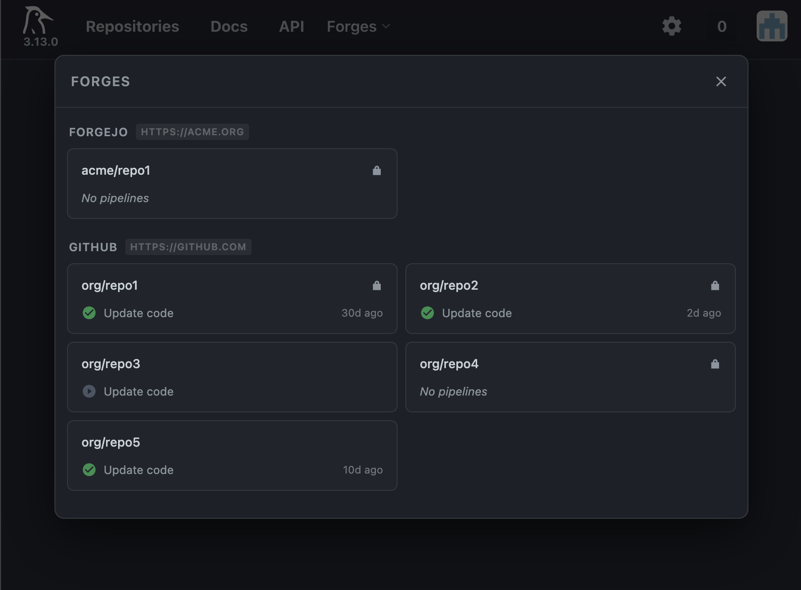

# Woodpecker CI Repository Overview

A browser extension that adds a cross-forge repository overview to the [Woodpecker CI](https://woodpecker-ci.org/) navigation bar. Open it to see all your repositories grouped by forge, jump directly to a repository, without needing to switch accounts or navigate through menus.



## Features

- **"Forges" button** injected into the Woodpecker navbar
- Repositories grouped by forge (GitHub, Forgejo, Gitea, etc.), each showing its URL
- Each repository card shows the **latest pipeline status** and commit message
- Click a repository card to **navigate directly** to it
- No configuration needed, uses your existing Woodpecker session

> The latest pipeline is only available for repositories that the current account has access to. For example, if you're logged in to Forge A, you won't see Forge B's pipelines.

## Installation (developer mode)

### Chrome / Edge / Brave

1. Open `chrome://extensions` (or `edge://extensions`)
2. Enable **Developer mode** (top-right toggle)
3. Click **Load unpacked**
4. Select the extension folder
5. Navigate to your Woodpecker CI instance, the **Forges** button appears in the navbar

### Firefox

> The extension was not tested against Firefox, it may or may not work.

## Scoping to your Woodpecker instance

By default the extension activates on all URLs and only injects when it detects a Woodpecker navbar. To limit it to a specific host, edit `manifest.json`:

```json
"content_scripts": [
  {
    "matches": ["https://ci.yourcompany.com/*"],
    ...
  }
]
```

> You may also restrict the sites the extension apply to by changing the extension settings in the browser.

## Limitations

- **Admin access may be required.** The `/api/forges` endpoint and `/api/repos` may return limited or no data depending on your Woodpecker instance configuration and your user's permission level. If the modal shows no forges or repositories, check whether your account has the necessary access.
- **All-URL host permission.** The extension requests `<all_urls>` to work on self-hosted instances at any domain. You can restrict this to your specific Woodpecker host in `manifest.json` as shown above or by using the browser extension settings.
- **Single Woodpecker instance.** The extension targets whichever Woodpecker instance you are currently browsing. It does not support switching between multiple Woodpecker servers.

## Note on multi-forge support

Woodpecker CI is actively working on multi-forge support. Once complete, functionality similar to this extension may be built directly into the UI. Track progress in [issue #138](https://github.com/woodpecker-ci/woodpecker/issues/138).
